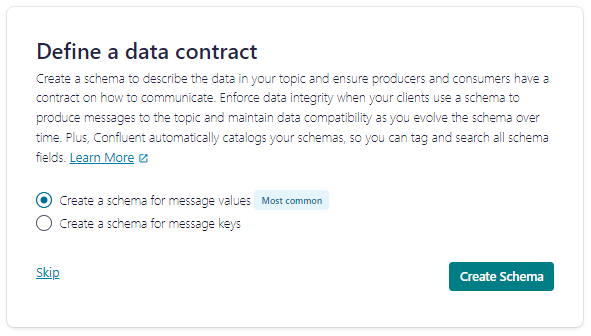

## Quantyca - Build with Confluent -  Quality gates through centralized computational policy enforcement


<div align="center" padding=25px>
    
</div>
<div align="center" padding=25px>
    
</div>

<br>

## **Problem Definition** 
### Challange
* Exploit a wider syntax than the one currently supported by Schema Registry’s domain rules
* Reference a central repository for policy definitions
* Apply policy enforcement as close as possible to data producers
* Define custom behaviour to handle bad data

### Solution
* Advanced Stream Governance enables usage of domain rules
* Schema Registry associates policies defined externally to topics’ schemas
* Open Data Mesh Platform provides the service for central policy management
* Data Product Descriptor Specification defines the data product ingredients to bind everything together

### Result
* Central and tech agnostic repository for policy management: avoid redundancy and facilitate integration
* Proactive quality gate enablement: data is verified before its publication enabling effective quality management


## **Executive Summary**

The key advantages of the solution include:

* Central and tech agnostic repository for policy management: avoid redundancy and facilitate integration.
* Proactive quality gates enablement: data is verified before its publication enabling effective quality management, leveraging the Stream Governance Advanced package of the Schema Registry.


## **Basic Diagram**
<div align="center" padding=25px>
    
</div>

## **Requirements** 

1. A Confluent Cloud account
2. Maven installed in your environment ([ref](https://maven.apache.org/install.html))
3. A tool such as curl (or Postman) to send REST requests

## **How to use the demo**

### Introduction
Let’s imagine a data product designed to handle real-time order production for an e-commerce platform. Orders must go through validation to ensure compliance with specified criteria. This validation needs to occur before the orders are propagated to the data warehouse for further analysis. In the following step-by-step process it is explained how to build a demo with Confluent Cloud and the [ODM Framework][1].


Steps to try the demo:

1. [Log into Confluent Cloud](#step-1)

2. [Create an Environment and Cluster](#step-2)

3. [Create Topics and walk through Confluent Cloud Dashboard](#step-3)

4. [Create an API Key Pairs](#step-4)

5. [Create policies in the OPA Server](#step-5)

6. [Set up the producer environment](#step-6)

7. [Produce messages](#step-7)

8. [Clean Up Resources](#step-8)

***

## **Prerequisites**
1. Create a Confluent Cloud Account.
    - Sign up for a Confluent Cloud account [here](https://www.confluent.io/confluent-cloud/tryfree/).
    - Once you have signed up and logged in, click on the menu icon at the upper right hand corner, click on “Billing & payment”, then enter payment details under “Payment details & contacts”. A screenshot of the billing UI is included below.

<div align="center" padding=25px>
    
</div>

2. Launch an OPA Server.
    - In the solution the OPA server is going to be the centralized place where all the policies are stored. To launch a local OPA server using Docker, you can use the following command:
    ``` sh
    docker run --name odmopa-opa-server -d -p 8181:8181 \
    openpolicyagent/opa:latest-rootless run --server --log-level=info \
    --log-format=json-pretty
    ```
3. Configure the Policy Service of the ODM Framework
    - Clone the repository from the official [Github page](https://github.com/opendatamesh-initiative/odm-platform-up-services-policy-opa)
    ``` sh
    git clone https://github.com/opendatamesh-initiative/odm-platform-up-services-policy-opa.git
    ```
    - Follow the README file inside the repository to run the application locally. At the end there will be the ODM Policy Service listening on the port 9001.
***


## <a name="step-1"></a>Log into Confluent Cloud

1. Log into [Confluent Cloud](https://confluent.cloud) and enter your email and password.

<div align="center" padding=25px>
    
</div>

2. If you are logging in for the first time, you will see a self-guided wizard that walks you through spinning up a cluster.

***

## <a name="step-2"></a>Create an Environment and Cluster

An environment contains clusters and its deployed components such as Apache Flink, Connectors, ksqlDB, and Schema Registry. You have the ability to create different environments based on your company's requirements. For example, you can use environments to separate Development/Testing, Pre-Production, and Production clusters. 

1. Click **+ Add Environment**. Specify an **Environment Name** and Click **Create**. 

>**Note:** There is a *default* environment ready in your account upon account creation. You can use this *default* environment for the purpose of this demo if you do not wish to create an additional environment.

<div align="center" padding=25px>
    
</div>

When it is asked to upgrade for more advanced Stream Governance capabilities, click **Upgrade to Stream Governance Advanced starting 1$/hour**. Note that using this option there will be **costs based on the time that your environment is active**. Currently there is no way to go back to Stream Governance Essentials, therefore the only way to stop paying is to delete the envirnment ([ref](https://docs.confluent.io/cloud/current/stream-governance/packages.html)). 

<div align="center" padding=25px>
    
</div>

2. Click **Create Cluster**. 

> **Note:** Confluent Cloud clusters are available in 4 types: Basic, Standard, Enterprise and Dedicated. Basic is intended for development use cases so you will use that for the demo Basic clusters only support single zone availability. Standard and Dedicated clusters are intended for production use and support Multi-zone deployments. If you are interested in learning more about the different types of clusters and their associated features and limits, refer to this [documentation](https://docs.confluent.io/current/cloud/clusters/cluster-types.html).

3. Chose the **Basic** cluster type. 

<div align="center" padding=25px>
    
</div>

4. Click **Begin Configuration**. 
5. Select **AWS** as the provider and **eu-west-2** as the region, with single zone.
6. Specify a **Cluster Name**. For the purpose of this lab, any name will work here. 

<div align="center" padding=25px>
    
</div>

> **Note** If you didn't enter credit card information at the beginning, it may ask you to enter credit card information at **Set Payment** step. When you sign up for a Confluent Cloud account, you will get free credits to use in Confluent Cloud.

<div align="center" padding=25px>
    
</div>


9. View the associated *Configuration & Cost*, *Usage Limits*, and *Uptime SLA* information before launching. 
10. Click **Launch Cluster**. 

***

## <a name="step-3"></a>Creates Topic and Walk Through Cloud Dashboard

1. On the navigation menu, you will see **Cluster Overview**. 

> **Note:** This section shows Cluster Metrics, such as Throughput and Storage. This page also shows the number of Topics, Partitions, Connectors, and ksqlDB Applications.  Below is an example of the metrics dashboard once you have data flowing through Confluent Cloud. 

<div align="center" padding=25px>
    
</div>

2. Click on **Cluster Settings**. This is where you can find your *Cluster ID, Bootstrap Server, Cloud Details, Cluster Type,* and *Capacity Limits*.
3. On the same navigation menu, select **Topics** and click **Create Topic**. 
4. Enter **orders** as the topic name, **3** as the number of partitions, and then click **Create with defaults**. 

<div align="center" padding=25px>
    
</div>

5. In the next page click **Create Schema** to create a Data Contract for the value of the topic.
<div align="center" padding=25px>
    
</div>

6. Copy the text inside file *src/main/avro/order.avsc* and place in the form on schema page. Then click **Create**
<div align="center" padding=25px>
    
</div>
   
7. Repeat the step 4 and create a second topic name **bad-orders** and **3** as the number of partitions. Don't set any Data Contract for this topic.

> **Note:** Topics have many configurable parameters. A complete list of those configurations for Confluent Cloud can be found [here](https://docs.confluent.io/cloud/current/using/broker-config.html). If you are interested in viewing the default configurations, you can view them in the Topic Summary on the right side. 

7. After topic creation, the **Topics UI** allows you to monitor production and consumption throughput metrics and the configuration parameters for your topics. When you begin sending messages to Confluent Cloud, you will be able to view those messages and message schemas.
8. Below is a look at the topic, **orders**, but you need to send data to this topic before you see any metrics.

<div align="center" padding=25px>
    
</div>

***

## <a name="step-4"></a>Create an API Key

### Create cluster key

1. Click **API Keys** on the navigation menu. 
2. Click **Create Key** in order to create your first API Key. If you have an existing API Key select **+ Add Key** to create another API Key.

<div align="center" padding=25px>
    
</div>

3. Select **Global Access** and then click **Next**. 
4. Copy or save your API Key and Secret somewhere. You will need these later on in the lab, you will not be able to view the secret again once you close this dialogue. 
5. After creating and saving the API key, you will see this API key in the Confluent Cloud UI in the **API Keys** section. If you don’t see the API key populate right away, refresh the browser.

### Create Schema Registry key

1. Click your environment name on the resources path on the top.
2. On the right side of the screen click **Add key** under the *Stream Governance API* description.
<div align="center" padding=25px>
    
</div>

3. Click on **Create Key** in order to create your first Schema registry API Key. If you have an existing API Key select **+ Add Key** to create another API Key
4. Copy or save your Schema registry API Key and Secret somewhere. You will need these later on in the lab, you will not be able to view the secret again once you close this dialogue.

## <a name="step-5"></a>Create policies in the OPA Server
Use a tool like Postman or cUrl to POST a policy in the ODM Policy Service. In the *src/main/resources/policies* folder you can find some policy sample, to use for the demo. Use the following commands to create the two policies that are used in the demo
``` sh
curl -X POST localhost:9001/api/v1/planes/utility/policy-services/opa/policies \
-H "Content-Type: application/json" -d @src/main/resources/policies/order_value.json

curl -X POST localhost:9001/api/v1/planes/utility/policy-services/opa/policies \
-H "Content-Type: application/json" -d @src/main/resources/policies/order_status.json
```

## <a name="step-6"></a>Set up the producer environment
1. Clone this repository
    ``` sh
    git clone ...
    ```
2. Set up the properties file (*src/main/resources/data-contracts.properties*), filling the following placeholders:
    - bootstrap_servers
    - cluster_api_key
    - cluster_api_secret
    - schema_registry_endpoint
    - schema_registry_basic_auth
3. Set all the needed env var:
    ``` sh
    export EMAIL_USER=<mail-address>
    export EMAIL_PASS=<password>
    ```
4. Open file containing the order data contract located in ** and modify the following fields:
    - **owner_email**: the owner of the data contract. A notification email will be sent to this address if there's a validation error.
    - **mail.smtp.host**: the host of the SMTP server used to send the mail. The mail address and password set in the previous step will authenticate to this server.
    - **mail.smtp.port**: the host of the SMTP server port used to send the mail.
5. Update the schema of topic *order* to include the metadata and domain rules:
    ``` sh
    curl -X POST http://<schema-registry-endpoint>/subjects/orders-value/versions \
    -u "<schema-registry-api-key>:<schema-registry-api-secret>" \
    -H "Content-Type: application/json" -d @src/main/resources/order-data-contract.json
    ```
### Domain rules
To enforce a validation of  policies written in the OPA Server, the solution makes use of domain rules. Those rules can be used to specify integrity constraints or data policies in a data contract. For a practical explanation of the possibilities offered by **domain rules** we suggest to read the following [blogpost][2] and the [official documentation][3].

## <a name="step-7"></a>Produce messages

Start the application to produce the invalid message:
``` sh
mvn exec:java -D"exec.mainClass"="org.opendatamesh.platform.up.policy.confluent.adapter.util.ProducerApp" -D"exec.args"="./src/main/resources/data-contracts.properties client-1"
```

In the terminal, the logs will show an error stating that the message failed the validation of the *order_value* policy. There will be two results:
- A mail will be sent to the owner email
- The message will be written in the dlq topic (*bad-orders*)

>**Note:** The kafka producer is defined in the package org.opendatamesh.platform.up.policy.confluent.adapter.org.opendatamesh.platform.up.policy.confluent.adapter.util.ProducerApp class. As it is configured, the producer will try to send only one message, the one defined in *src/main/resources/order.json* file. You can change the code to send infinite messages or change the sent order.

## <a name="step-8"></a>Clean Up Resources

Deleting the resources you created during this demo will prevent you from incurring additional charges. 

1. Under **Environment Settings**, select the **Delete Environment** button at the bottom of the left menu. Enter the **Environment Name** and select **Continue**. 

2. Stop the Policy Service of ODM framework from the terminal where it was launched

3. Stop the Docker container of the OPA Server that runs on your local machine with the following command
    ``` sh
    docker stop <container-id>
    ```

*** 

## Relevant Links 

* [Data contracts in Confluent][3]
* [Blogpost with domain rule demo][2]
* [Open Data Mesh intiative page][4]

[1]: https://github.com/opendatamesh-initiative
[2]: https://www.confluent.io/blog/data-contracts-confluent-schema-registry/
[3]: https://docs.confluent.io/platform/current/schema-registry/fundamentals/data-contracts.html
[4]: https://dpds.opendatamesh.org/